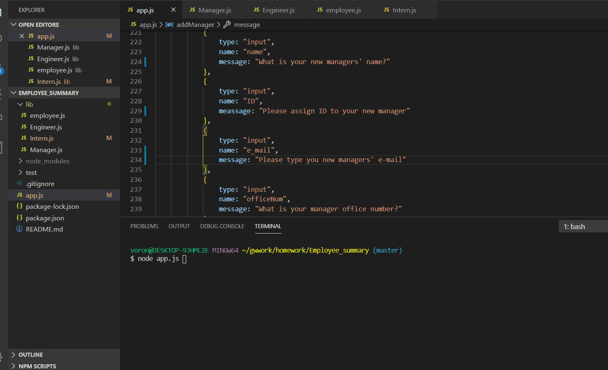
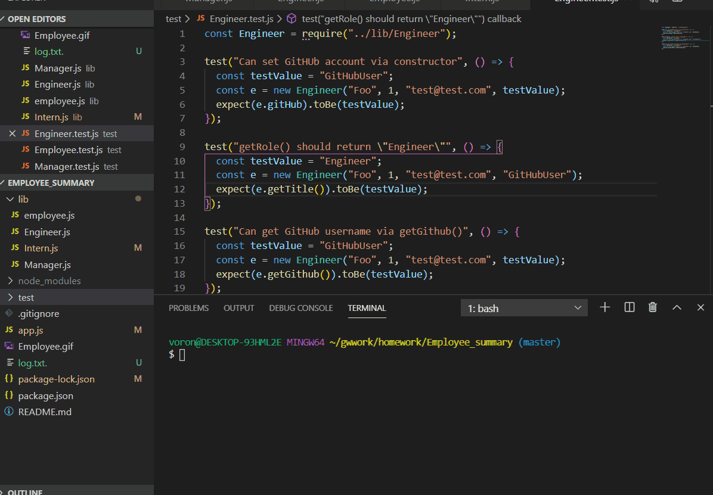

As a HR Manager you can use this simple tool to add members to you team. Employee_node_app lets you add managers, engineers, and interns to the app. 
Below are the steps on how the app operates.

In order to add member to your team, Employee_node_app has to confirm that user is authorized to add a team member by asking to confirm that a person is an HR manager.
The Employee_node_app provides with choices of who they want to add to a list of employees. The choices are: Engineer, Manager, Intern or NooOne. 
To add a manager user need to choose Manager choice, to add an engineer, user has to choose Engineer, and to add an Itern, user has to choose an Intern.
After user selescts who they want to add he/she is asked a fe questions about person that one wants to add to a team. User would need following infomation in oreder to add persons information to a team. The user would need to provide: Name, ID, e-mail address of the person, gitHub id for the engineer, office number for the manager and school name for the intern.
At the end Employee_node_app will generate a text file with team members typed on it.

Below developer cunducted testing of all of the functions that we used in classes.

